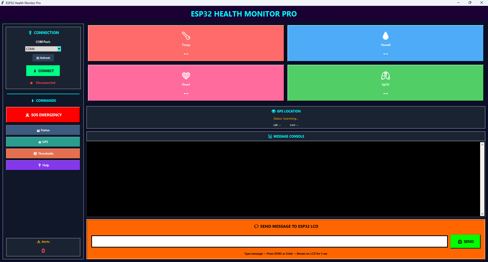

<h1 align="center">IoT Soldier Health Monitoring System</h1>

<p align="center">
An ESP32-based IoT system for monitoring soldier health parameters and location with real-time visualization and multi-mode SOS alert mechanisms.
</p>

<br>

## Project Overview

The **IoT Soldier Health Monitoring System** is designed to monitor critical health and environmental parameters of soldiers in real time. The system collects physiological and environmental data using multiple sensors connected to an ESP32 microcontroller.

Sensor readings are transmitted to a **Python-based monitoring application** via Bluetooth, where operators can observe real-time data and respond to emergency alerts.

The system also includes a **local LCD display**, allowing readings and alerts to be viewed directly on the hardware device.

<br>

## System Features

* Real-time health monitoring
* Temperature and humidity sensing
* Heart rate and SpO₂ monitoring
* GPS-based location tracking
* Python-based monitoring interface
* Multi-mode SOS alert system
* Local display using I2C LCD
* Threshold-based automatic emergency detection

<br>

## Hardware Components

* **ESP32 Development Board** – main microcontroller
* **DHT11 Sensor** – temperature and humidity monitoring
* **MAX30100 Sensor** – heart rate and SpO₂ measurement
* **NEO-6M GPS Module** – location tracking
* **16×2 I2C LCD Display** – local monitoring interface
* **SIM800L GSM Module** – backup communication option
* **Physical SOS Button** – manual emergency trigger
* **Buck Converter** – 12V to 5V voltage regulation
* **12V 2A Power Adapter** – system power source

<br>

## Software Components

### ESP32 Firmware

The firmware running on the ESP32 is responsible for:

* Reading sensor data
* Displaying readings on the LCD
* Monitoring threshold limits
* Handling SOS triggers
* Transmitting data to the monitoring application via Bluetooth

### Python Monitoring Application

The Python application serves as the system's user interface and provides:

* Real-time sensor monitoring
* System interaction through GUI controls
* SOS alert management
* Display of sensor threshold values

<br>

## Monitoring Application Controls

The Python application includes four primary control options:

**Current Readings**
Displays the most recent sensor values received from the ESP32.

**Help**
Provides instructions and guidance on using the monitoring application.

**Threshold Values**
Displays the predefined safety limits used for automatic alert detection.

**Trigger SOS**
Allows the user to manually activate an emergency alert.

<br>

## Python Monitoring Interface



<br>

## SOS Alert System

The system supports three independent SOS triggering mechanisms:

1. **Application Trigger** – manual activation from the Python monitoring interface
2. **Hardware Trigger** – physical SOS button connected to the ESP32
3. **Automatic Trigger** – activation when sensor values exceed predefined thresholds

When an SOS alert is triggered:

* All sensor readings are transmitted immediately
* The alert is displayed on the Python monitoring application
* The alert is shown on the LCD display

<br>

## Communication Method

The ESP32 communicates with the monitoring application using **Bluetooth serial communication**.

Although the system includes a **SIM800L GSM module**, it is currently integrated as a backup communication option for future remote alert transmission.

<br>

## Power Architecture

The hardware system is powered using a **12V 2A adapter** connected to a **buck converter**, which reduces the voltage to **5V** for sensors and modules.

During development, the **ESP32 is powered separately via USB**, allowing both power supply and data communication with the monitoring application.

<br>

## Repository Structure

```
IoT-Soldier-Health-Monitoring-System
│
├── firmware        # ESP32 embedded code
├── python_app      # Python monitoring application
├── hardware        # Hardware documentation
├── docs            # Project documentation and reports
├── images          # System photos and screenshots
```

<br>

## Future Improvements

* Integration of AI-based health anomaly detection
* Remote alert transmission using GSM or internet connectivity
* Historical health data logging and visualization
* Monitoring multiple devices simultaneously
* Battery-powered portable system design

<br>

## Author

**Rajas Shyam Ghongade**

Developer and system designer of the IoT Soldier Health Monitoring System.
Responsible for ESP32 firmware development, Python backend integration, system architecture design, and overall hardware–software integration.
